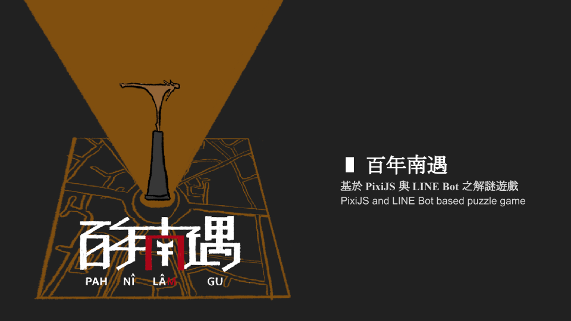
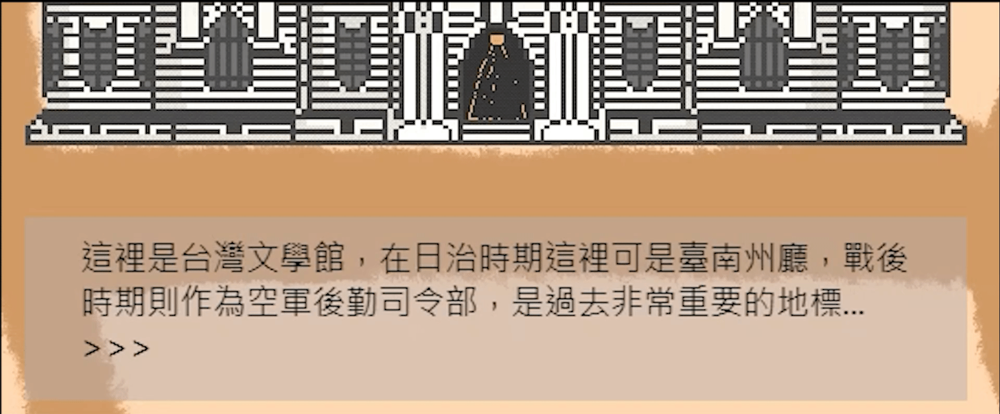

****
# 百年南遇
2022年上下學期畢業專題--「百年南遇」。前端遊戲畫面主要使用PixiJS完成，遊戲LineBot則利用expressJS建置，並架設在Heroku雲平台上（目前已下架）。

1. [百年南遇-遊戲前端入口](https://noz915.github.io/pah-ni-lam-gu/main.html)
2. [百年南遇-書面報告](https://docs.google.com/document/d/1b_VGhIp5eUpohtB7jNVG5N_HoHWSJN9VmPhkHtEM24c/edit?usp=sharing)
3. [百年南遇-投影片](https://docs.google.com/presentation/d/1IXXf0MIS3k_l0Jnd580INA85UtnBAWc_ZGxwA0tmMuw/edit?usp=sharing)
4. [百年南遇-前導預告影片](https://youtu.be/Qwqrl_vaZo0?si=Eug3rODSk7UPNcpg)
  

## 功能說明
### 首頁
首頁按下Start即進入遊戲主畫面。，也可選擇help來幫助操作遊戲畫面。

### 與對話框互動
靠近相關建築物，即會觸發對話框，部分會觸發多個對話框，可以依靠空白鍵，跳到下一個對話。

### 取得道具
可透過Line Bot線索，找到藏匿的道具，使用者已可能先行找到道具，但沒有Line Bot的對話推進下，無法進行劇情的推演。找到的道具將顯示在遊戲畫面的右上角，可透過點擊右上角已蒐集到的道具圖示，來展開並可察看道具細節與內容。

### 切換場景
透過空白鍵在正確的入口下可切換至不同場景。

### 設計說明
#### 1. 遊戲大綱
路忻是名時空旅行者，他在一次的時空旅行中操作失誤，因而被困在錯誤的時空之中，在這四處黑暗無邊無際的空間中，所幸路忻手邊還有台前輩留給他的舊時空轉換器，而這台舊型時空轉換器，雖有通訊功能，但系統過舊早已被停用，因此路忻必須靠自己使用舊型時空轉換器來回到原先的時空，只是對於其中的線索實在摸不著頭緒，正當路忻還在為解開答案而煩惱時，通訊功能的訊號突然亮了起來…  

另一方面，玩家雖與路忻處於不同的時空，卻因相近的地點使兩人通訊設備頻率相似，進而有了聯繫，路忻是否能回到原先所處的時空，端看玩家如何應對這名不速之客的請求。  

#### 2. 遊戲背景
關卡時空背景由清朝、日治、現代遞進，地點則位於臺南市永華里與南門里間的六處景點，針對不同時代，對應到當時重要的地點，並且以當時代的舊名、舊址作為謎題一大特色，因此玩家必須了解臺南過去的樣貌，方可順利解開謎題。  

#### 3. 遊戲操作
a.遊玩工具：利用網頁前端、line bot。  
b. 上、下、左、右鍵：用於移動角色。  
c. 空白鍵：用於建築互動。  
d. 滑鼠點擊：用於返回首頁、進入遊戲頁面、進入幫助頁面。  
